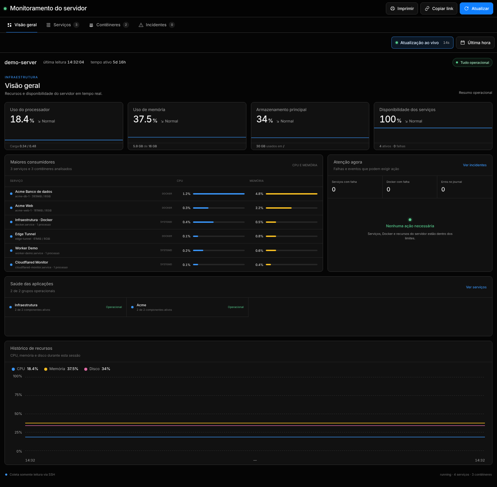
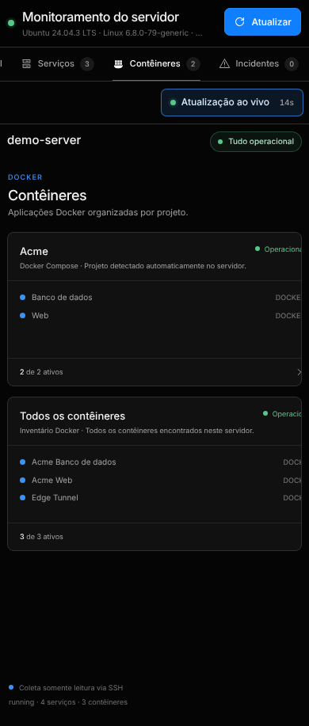

# Notserver Monitor

[](https://github.com/ninex9x/notserver-monitor/actions/workflows/ci.yml)
[](https://github.com/ninex9x/notserver-monitor/actions/workflows/secret-scan.yml)

Dashboard web responsivo e aplicativo Android para acompanhar servidores Linux
localmente ou por SSH. O monitor reúne CPU, memória, discos, uptime, serviços
`systemd`, contêineres Docker e eventos críticos do `journal` em uma interface
somente leitura.

> Projeto de portfólio voltado a observabilidade leve, operação segura e acesso
> móvel, sem agentes instalados no servidor monitorado.

[Estudo de caso](docs/CASE_STUDY.md) ·
[Implantação](docs/DEPLOYMENT.md) ·
[Roadmap](docs/ROADMAP.md)

| Visão geral | Contêineres no celular |
| --- | --- |
|  |  |

## Recursos

- coleta local ou remota por SSH;
- descoberta automática de projetos Docker Compose e seus subserviços;
- visão consolidada de CPU, memória, carga, uptime e discos;
- estado e consumo de serviços `systemd` e contêineres Docker;
- consulta limitada a eventos recentes do `journal`;
- alertas de indisponibilidade e saturação;
- autenticação por token com cookie seguro no painel;
- aplicativo Android com verificações em primeiro e segundo plano;
- atualização privada do APK com validação de tamanho e SHA-256;
- modo de demonstração com dados inteiramente fictícios.

## Início rápido

### Requisitos

- Node.js 24 ou superior;
- Git;
- SSH, Docker e `systemd` somente para monitoramento real.

Clone e abra o modo demonstração, que não acessa nenhum servidor:

```bash
git clone https://github.com/ninex9x/notserver-monitor.git
cd notserver-monitor
npm run demo
```

Abra <http://127.0.0.1:4242>. O projeto não possui dependências npm e não
grava dados.

## Arquitetura

```text
Navegador ───────┐
                 ├──> API Node.js ──> coleta somente leitura ──> Linux local
Android/WebView ─┘                                      └──────> Linux via SSH
```

O backend expõe apenas operações de leitura. Os comandos de coleta são fixos no
código; destinos SSH e nomes de unidades são validados antes da execução.

## Configuração

Copie o modelo antes de conectar o monitor a um ambiente real:

```bash
cp .env.example .env
```

O arquivo `.env` é carregado automaticamente por `npm start` e `npm run dev`.
Ele é ignorado pelo Git e deve permanecer somente na máquina de execução.

| Variável | Padrão | Finalidade |
| --- | --- | --- |
| `NOTSERVER_SSH_TARGET` | `notserver` | Alias, host ou `usuario@host` usado pelo SSH |
| `HOST` | `127.0.0.1` | Interface em que o painel escuta |
| `PORT` | `4242` | Porta HTTP local |
| `MONITOR_DEMO` | `false` | Usa dados fictícios e não inicia SSH |
| `MONITOR_LOCAL` | `false` | Coleta no próprio host |
| `MONITOR_ACCESS_TOKEN` | vazio | Token fornecido diretamente ao processo |
| `MONITOR_ACCESS_TOKEN_FILE` | vazio | Caminho do arquivo de token; opção recomendada |
| `MONITOR_PUBLIC_ORIGIN` | vazio | Origem HTTPS esperada atrás do proxy |
| `MONITOR_UPDATE_DIR` | `updates/` | Diretório privado dos metadados e do APK |

O serviço escuta somente em `127.0.0.1` por padrão. Para acesso remoto, use um
túnel SSH ou um proxy HTTPS autenticado. Nunca exponha logs e métricas na rede
sem token, firewall e TLS adequados.

## Comandos

| Comando | Descrição |
| --- | --- |
| `npm start` | Inicia o monitor usando `.env`, quando disponível |
| `npm run dev` | Inicia o backend com recarga automática |
| `npm run demo` | Inicia com dados fictícios, sem SSH |
| `npm test` | Executa os testes automatizados |

Principais endpoints autenticados:

| Método | Endpoint | Finalidade |
| --- | --- | --- |
| `GET` | `/api/status` | Retorna a fotografia completa do servidor |
| `GET` | `/api/status?refresh=1` | Força uma nova coleta |
| `GET` | `/api/health` | Retorna a saúde resumida para probes e Android |
| `GET` | `/api/logs?unit=ssh.service` | Retorna logs de uma unidade validada |
| `GET` | `/api/app-update` | Retorna metadados da atualização privada |
| `GET` | `/api/app-update/apk` | Entrega o APK privado autenticado |

## Android

O projeto Android requer JDK 17 e Android SDK 34:

```bash
cd android
MONITOR_BASE_URL=https://monitor.example.com \
MONITOR_ACCESS_TOKEN_FILE=/caminho/privado/access-token \
./gradlew assembleRelease
```

O endereço e o token são incorporados ao APK durante a compilação. Por isso,
APKs configurados, chaves de assinatura e arquivos `.idsig` não são publicados
neste repositório nem em releases públicas. Distribua uma compilação pessoal
somente por um canal privado e gere outra credencial se o aparelho for perdido.

O app verifica a saúde a cada 30 segundos em primeiro plano e aproximadamente a
cada 15 minutos em segundo plano. Uma indisponibilidade transitória só é
confirmada depois de duas falhas consecutivas; falhas de autenticação são
classificadas separadamente.

## Segurança e privacidade

- o token é comparado em tempo constante;
- a interface usa cookie `Secure`, `HttpOnly` e `SameSite=Strict`;
- as verificações nativas usam `Authorization: Bearer`;
- CSP, HSTS, proteção contra frames e políticas de recursos são aplicadas;
- a API não aceita comandos arbitrários;
- `.env`, tokens, APKs, keystores, bancos e configurações reais são ignorados;
- o CI executa testes, build Android sem credencial e varredura com Gitleaks.

Leia [.github/SECURITY.md](.github/SECURITY.md) antes de relatar uma
vulnerabilidade. Use um GitHub Security Advisory; não publique credenciais em
issues.

## Estrutura

```text
.github/        CI, política de segurança e templates
android/        aplicativo Android nativo
deploy/         modelos de systemd e Cloudflare Tunnel
docs/           estudo de caso, implantação e roadmap
public/         interface web estática
src/            autenticação, coleta e atualizações
test/           testes automatizados
server.mjs      servidor HTTP e API
```

## Contribuindo e licença

Consulte [.github/CONTRIBUTING.md](.github/CONTRIBUTING.md) antes de abrir um
pull request.

Este repositório ainda não declara uma licença. A publicação permite estudar o
código, mas não concede automaticamente permissão de uso, modificação ou
redistribuição.
